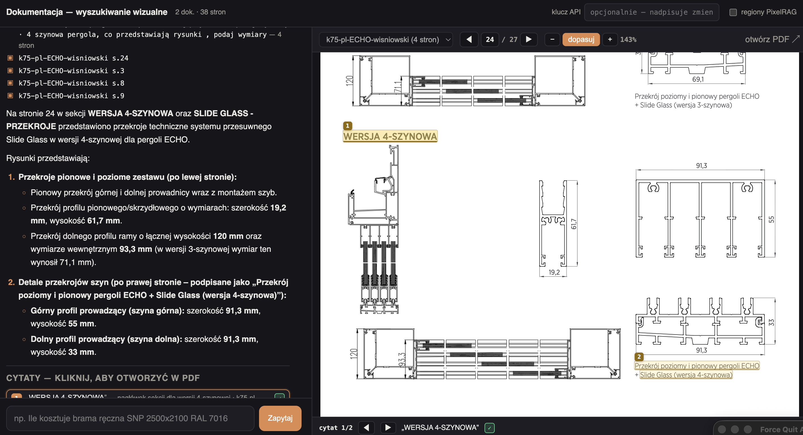

# Visual RAG (PixelRAG)

Search technical PDFs by how pages **look** (drawings, tables, dimension callouts),
then answer from page screenshots with a VLM.

Thin layer over [PixelRAG](https://github.com/StarTrail-org/PixelRAG): index +
serve stay upstream; this repo adds page-level retrieval, optional BM25 hybrid,
citations, and a web UI.

# Jev experiments

[TypeSafe](https://docs.typesafe.ai/) / Jev latency-focused demos. Each app lives in its own top-level directory with its own README, TESTING.md and screenshots.



## PDFS source
https://www.wisniowski.pl/images/foldery-online/pl/k75-pl-ECHO-wisniowski/#page=24

## Setup

```bash
brew install poppler jpeg-turbo
uv venv --python 3.12
uv pip install 'pixelrag[index,serve,pdf]'
# plus whatever ask.py / app.py need (google-genai / anthropic, fastapi, …)
```

Put PDFs in `pdfs/`. Copy API keys into `.env` (`GEMINI_API_KEY` or `ANTHROPIC_API_KEY`).

## Index

```bash
.venv/bin/python scripts/prepare_hires.py
.venv/bin/python scripts/build_index.py
.venv/bin/python scripts/build_text_index.py   # BM25 sidecar (hybrid)
```

## Run

```bash
# 1) FAISS search API
KMP_DUPLICATE_LIB_OK=TRUE OMP_NUM_THREADS=1 .venv/bin/pixelrag serve \
  --index-dir ./index --tiles-dir ./index/tiles \
  --articles-json ./index/articles.json --port 30001 --device cpu

# 2) query-encoder sidecar (optional but much faster on Apple Silicon)
.venv/bin/python scripts/encoder.py

# 3) ask CLI or UI
.venv/bin/python scripts/ask.py "…"
.venv/bin/python scripts/app.py          # http://127.0.0.1:8000
```

## Ask modes

| `PIXELRAG_ASK` | Behaviour |
|---|---|
| `oneshot` (default) | retrieve top pages → one VLM read of page JPEGs |
| `agent` | multi-turn `search` / `tile` browse |

## Retrieval modes

Which retriever finds the pages is separate from which reader answers. Seven
named modes, pickable per question — in the UI header, with `ask.py
--retrieval`, or as `retrieval=` on `POST /api/ask`:

| Mode | What runs | top-1 |
|---|---|---|
| `visual` | the pixel index alone — the claim this project exists to test | 62% |
| `hybrid` | visual + BM25 over the PDF text layer, fused by rank (RRF) | 85% |
| `jev-expand` | Jev-chosen phrasings, then `visual` verbatim — no reranker | 62% |
| `jev` | visual candidates, Jev-expanded queries, Jev-reranked chunks | 77% |
| `jev+hybrid` | the same Jev pool, with BM25 page candidates poured into it | 77% |
| `jev-page` | `hybrid`, then Jev reranks the candidate **pages** on full text | **92%** |
| `xray` | **no retrieval** — every page of the corpus, judged in one call | **92%** |

top-1 is `scripts/bench.py --verified`, k=4, on the 13 questions whose gold page
is decided by literal string match rather than by a model. `jev-page` is the
default when a key is present; see
[Does the reranker earn its bill?](#does-the-reranker-earn-its-bill--answered-the-page-one-does-the-chunk-one-does-not)
for why it is not `jev`, and why `jev-expand` is kept despite scoring what
`visual` scores.

The two Jev modes also return an **answerability** score: does the retrieved
content actually contain an answer, independent of how it ranked. Ranking always
produces a rank 1, so no score can say "nothing here answers this" — see
[Is the answer even in there?](#is-the-answer-even-in-there).

`jev-expand` exists to make one subtraction possible: Jev's two stages cost
about 500 input tokens and about 11k respectively, and they used to be
purchasable only as a pair, so "is the reranker earning its bill" had no
experiment. `visual → jev-expand → jev` isolates one stage per step — and the
subtraction has now been done. **`jev-expand` scores exactly what `visual`
scores**, so the expansion stage is measured dead weight and the mode is kept
only to keep proving it.

`auto` resolves to `jev-page` when a key is present, and to `hybrid`/`visual`
otherwise. It used to resolve to `jev`/`jev+hybrid`; it does not any more,
because `jev` is beaten by `hybrid` on the question set at 300x the latency.
`PIXELRAG_JEV=manual` keeps the Jev modes selectable without defaulting to them,
and `PIXELRAG_JEV=0` stops TypeSafe being called at all.

The flags are deliberately asymmetric in the other direction too: naming
`hybrid` explicitly turns BM25 on regardless of `PIXELRAG_HYBRID`, since the
only real question is whether the sidecar exists. `PIXELRAG_JEV=0` stays a kill
switch that a dropdown in a browser cannot overrule. A mode that cannot run here
stays in the list, greyed, with the reason.

The answer cache keys on the resolved mode, so switching modes re-answers
rather than replaying pages the new mode never retrieved.

### What each mode is actually made of

Every mode runs the same spine — **query → encode → faiss over pixel-crop
embeddings → aggregate crops into pages → top-`k` whole page JPEGs to the
reader**. Only two slots differ:

| mode | phrasings from | retrievers | reranker | Jev calls |
|---|---|---|---|---|
| `visual` | local regex strip | pixel faiss | — | 0 |
| `hybrid` | local regex strip | pixel faiss **+ BM25**, fused by RRF | — | 0 |
| `jev-expand` | **Jev** | pixel faiss | — | 1 |
| `jev` | **Jev** | pixel faiss | **Jev** | 2 |
| `jev+hybrid` | **Jev** | pixel faiss + BM25 **into the same pool** | **Jev** | 2 |
| `jev-page` | local regex strip | pixel faiss + BM25, fused by RRF | **Jev, on whole pages** | 1 |
| `xray` | — (none searched) | **none** — the text sidecar is read whole | **Jev, on every page** | 1 |

`hybrid` fuses BM25 as a second voter. `jev+hybrid` instead pours BM25's pages
into the candidate pool as extra chunks for Jev to score — so it is not "hybrid
plus jev", it is different wiring, and it is why BM25 is not also fused by RRF
there.

### What a "chunk" is — pixels, text, or both

Three different units travel under that word, and only the first is what the
chunk counts report:

1. **The retrieval unit is pixels.** A chunk is an **875x1024 crop** of a
   1654x2339 rendered page — 8 per page, 2 columns by 4 overlapping rows,
   embedded by the visual model. "27 chunks" in a comparison row means 27 image
   crops.
2. **BM25's unit is a whole page of text.** `index/text.json` holds one entry
   per page, not per chunk. In `hybrid` the pixel side votes with crops and the
   text side votes with entire pages.
3. **Jev's rerank unit is both.** The geometry is a pixel chunk's rectangle; the
   content is PDF text clipped to that box, capped at 6,000 characters.

**None of them reach the reader's context.** In one-shot mode the reader is sent
`PIXELRAG_ONESHOT_PAGES` **whole-page JPEGs** — never crops, never text — and
those images are the ~5,700 input tokens. Chunks only decide *which pages get
attached*, so the chunk counts are funnel width, not context size, and context
is the same in every mode. (Agent mode is the exception: `pixelrag_tile` hands
the reader individual crop images.)

Note for anyone reading `GIST_BONUS` in `retrieve.py`: **this index has no gist
chunks.** All 88 chunks in article 0 and all 213 in article 1 are `scale:
region`, so the whole-page vector that constant reweights does not exist here
and the constant is inert. Rebuilding with multiscale gist vectors is what would
make it — and any page-versus-region routing — mean anything.

### Comparing them

Tick **porównaj tryby** in the UI and ask a question: every available mode runs
its retrieval and reports back, side by side. **No reader is called**, so a
four-mode comparison costs four retrievals and zero image tokens; each row has
an "odpowiedz tym trybem" button when you want the answer from one of them.

Each row reports the funnel and the bill: pages returned, unique chunks pulled,
candidate pages considered, how many queries were issued, which reranker ran,
wall clock, and retrieval cost. `szczegóły` opens the rest — query variants,
the Jev facets with their scores, per-stage timings, per-call tokens, and each
retriever's own top-5 list. A page only one mode found is drawn with a dashed
border, and a closing "zgodność" card says which modes agreed on what.

Read the notes line first. Every Jev stage degrades quietly by design (failed
expansion, chunks with no PDF text, a rejected score), and a run that fell back
to the original retrieval is billed like one that worked and looks like one
everywhere else.

The same comparison from a terminal, including `--json`:

```sh
.venv/bin/python scripts/compare.py "Ile kosztuje brama Connect?"
.venv/bin/python scripts/compare.py --modes visual,jev --json "…"
```

`evaluate_pl.py` answers the other question — which mode is better across the
labelled question set, offline. This one answers what happened to *this*
question just now, which is what you need when one answer cited the wrong page:
the right page was either missing from the candidate pool, below the cut, or
there and reranked away, and those are three different bugs.

An answer's footer reports the same shape for the mode that produced it:
retrieval time, time to first token, total, and the reader's own tokens and
cost — split rather than summed, because retrieval is the part the mode changes
and the reader is the part that bills.

## Useful env

| Var | Default | Meaning |
|---|---|---|
| `PIXELRAG_HYBRID` | `0` | default-picks BM25 fusion (`1` = on); see "Retrieval modes" |
| `PIXELRAG_JEV` | `auto` | `1` makes a Jev mode the default; `auto` selectable-only; `0` kills it |
| `PIXELRAG_JEV_REFUSE` | `0` | refuse below this answerability, without paying for the reader |
| `PIXELRAG_JEV_DEPTH` | `24` | chunks pulled per phrasing before the rerank |
| `PIXELRAG_JEV_POOL` | `64` | chunks scored in one rerank call |
| `PIXELRAG_JEV_PAGES` | `16` | candidate pages scored by `jev-page` |
| `PIXELRAG_XRAY_BUDGET` | `48000` | input tokens per `xray` shard; under Jev's 64k window |
| `PIXELRAG_XRAY_SHARDS` | `8` | above this the corpus is too big to sweep and `xray` refuses |
| `PIXELRAG_XRAY_PAGE_CHARS` | `6000` | per-page truncation inside a sweep |
| `PIXELRAG_ORACLE_GOLD` | `0.66` | score at which a page becomes gold in the generated set |
| `PIXELRAG_CHUNK_CONTEXT` | `0` | chars of the page's head prepended to each crop's text |
| `TYPESAFE_API_KEY` | — | enables `jev` / `jev+hybrid` |
| `TYPESAFE_MODEL` | `jev-latest` | Jev model |
| `TYPESAFE_PRICE_IN` / `_OUT` | `0.042` / `0` | USD per million tokens; defaults are the published jev-1.13 rate |
| `PIXELRAG_ONESHOT_PAGES` | `4` | pages attached to the reader |
| `PIXELRAG_ASK` | `oneshot` | `oneshot` \| `agent` |
| `GEMINI_MODEL` | `gemini-3.6-flash` | reader model |
| `PIXELRAG_PROVIDER` | auto | force `gemini` \| `anthropic` |
| `ANTHROPIC_EFFORT` | `medium` | thinking depth for the read; empty = API default |
| `PIXELRAG_ANSWER_CACHE` | `1` | reuse answers for near-identical questions |
| `PIXELRAG_CACHE_THRESHOLD` | `0.95` | cosine cut for a cache hit |
| `PIXELRAG_LOG` | `warning` | `debug`\|`info`\|`warning`\|`error` — see "When it degrades" |
| `PIXELRAG_INDEX_DIR` | `./index` | index tree; relative paths resolve against the repo root |
| `PIXELRAG_IMAGE_FIT` | `1` | downscale pages to the reader's billed resolution |
| `PIXELRAG_IMAGE_FLOOR` | `0.85` | how much shrink `imagefit` may spend chasing a cheaper tile grid |
| `PIXELRAG_ANTHROPIC_LONG_EDGE` | `1568` | Anthropic tier to target; `2576` sends high-res |

## Cost

The reader is the whole bill — retrieval is ~145ms of local CPU and free, in
every mode but the Jev ones, which add two TypeSafe calls per question.

**Measured** on this index, `gemini-3.6-flash`, 4 pages attached:

| | input tokens | wall clock |
|---|---|---|
| cold question | 5725 | ~8.7 s |
| repeat question (answer cache) | **0** | **~0 ms** |

**Not measured** — no Anthropic credentials on this box. From the documented
`w*h/750` rule, `claude-opus-5` sits in the high-res tier (2576px) and bills a
200-DPI page at ~5158 tokens, which clamping to 1568px should roughly halve.
Confirm against a real `usage.input_tokens` before believing it: the same
reasoning applied to Gemini's published 768px-tile model predicted a 50% saving
and delivered **exactly zero** (5725 tokens either way — the model normalises
images before billing). Gemini tile-chasing is off by default for that reason;
`PIXELRAG_GEMINI_TILE_CHASING=1` re-enables it if you measure otherwise.

`scripts/imagefit.py` run directly prints the predicted table for your index —
predicted, not billed. `scripts/answer_cache.py` prints hit rate and contents;
`--clear` empties it. The cache keys on the question's embedding plus an
exact-match namespace (model, page budget, retrieval mode, index fingerprint), so
rebuilding the index or changing any of those misses rather than answering from
stale pages.

Measured cosine for the cache, same encoder as retrieval: identical question
1.00, reordered 0.97, politeness prefix 0.95, synonym swap 0.90, unrelated
question 0.24. The default `0.95` catches rewordings with a wide margin over
anything unrelated; drop to `0.90` to catch synonym swaps if your evals support
it.

### Transcribing pages to text does not pay here — measured

`scripts/transcribe.py` reads a page once into structured markdown so the reader
never re-reads the pixels. On `gemini-3.6-flash` it **costs more than it saves**:
transcripts averaged **1.25× the tokens of the image** across 9 pages, because
Gemini bills any page image at a flat ~1093 tokens while text scales with
density. A 21-column weight matrix cost 3707 tokens as markdown against 1093 as
pixels — and tables like that are precisely the pages that answer questions.

The tool is kept because the verdict is provider-specific: Anthropic bills a
200-DPI page at ~2318–5158 tokens by area, where even the worst transcript wins.
Run `--measure` before assuming either way. It is not wired into `rag.py`.

Visual-only is the default on purpose (the experiment). Hybrid usually ranks
better when PDFs have a text layer; turn it on with `PIXELRAG_HYBRID=1`.

## Layout

| Path | Role |
|---|---|
| `pdfs/` | source documents |
| `index/` | tiles, vectors, `text.json` |
| `scripts/rag.py` | orchestration: retrieve → read → cite (shared by CLI/UI) |
| `scripts/providers.py` | the model backends behind one `Reader` interface |
| `scripts/retrieve.py` | chunk→page aggregation, RRF hybrid — pure, no IO |
| `scripts/pagehit.py` | the retrieved-page record, shared by all three layers |
| `scripts/layout.py` | where the index is on disk, and how it is named |
| `scripts/chunkmeta.py` | chunk geometry and scale, read once |
| `scripts/imagefit.py` | downscale pages to what the reader actually bills |
| `scripts/answer_cache.py` | reuse answers for near-identical questions |
| `scripts/lexical.py` | BM25 over PDF text |
| `scripts/xray.py` | the whole corpus, every question, in one call |
| `scripts/oracle.py` | builds and labels `eval/questions_pl.yaml` |
| `scripts/bench.py` | every mode over that set; `--verified` for a non-circular referee |
| `scripts/calibration.py` | order-invariance and OOD calibration; the bar for any replacement |
| `scripts/citations.py` | quote → highlight rectangles |
| `scripts/snip.py` | crop a page around a citation, for chat inline |
| `scripts/app.py` + `static/` | web UI |
| `tests/` | the pure logic, runnable with no services and no API key |
| `eval/` | the generated question set (`scripts/oracle.py`) |

`scripts/evaluate.py` / `evaluate_pl.py` / `answer_all.py` expect YAML under
`eval/`. `scripts/oracle.py` generates it from the corpus, `scripts/bench.py`
reads it for a per-mode comparison, and `evaluate_pl.py` runs against it for the
first time since the corpus behind its old ground truth was replaced.

## Tests

```bash
uv pip install --python .venv/bin/python pytest
.venv/bin/python -m pytest
```

No search service, no encoder, no API key, no network. The answer pipeline runs
end to end against a `FakeReader` (see `tests/conftest.py`), so prompt assembly,
streaming, citations, cost and the answer cache are all covered without paying
for a read.

## When it degrades

The system falls back rather than failing — six times over. Each fallback is
correct and each one now says so:

| Symptom | What you get |
|---|---|
| encoder sidecar down | model loads in-process; first query pays ~30s (`INFO`) |
| local encode fails | server-side encoding, ~7x slower (`WARNING`) |
| question can't be embedded | answer cache off for that query (`WARNING`) |
| `PIXELRAG_HYBRID=1`, no `text.json` | answers visual-only (`WARNING`) |
| page can't be resized | sent at full resolution, billed accordingly (`WARNING`) |
| citations can't be resolved | answer stands, no highlights (`WARNING`) |

`PIXELRAG_LOG=info` or `scripts/ask.py --log info` to see them; the CLI sends
them to stderr so they never interleave with a streamed answer.

### Jev query expansion and chunk reranking

Set `TYPESAFE_API_KEY` in the project `.env` file or export it to enable the
TypeSafe Jev stage automatically. CLI and UI load `.env`; exported values take
precedence:

```sh
export TYPESAFE_API_KEY=...
.venv/bin/python scripts/ask.py "Ile kosztuje brama Connect?"
```

Both one-shot retrieval and agent searches select query expansions with Jev,
retrieve and deduplicate candidate chunks, then score their relevance to the
original question before selecting context for the reader. In `jev+hybrid`,
lexical page candidates enter that same scoring stage — a page BM25 nominated
enters the pool as chunk 0 with score 0.0 (it has no cosine and must not
pretend to one) and is judged on its text like any other candidate, which is
the only route by which a page the pixel index never saw reaches the reader.
BM25 is therefore *not* fused a second time by RRF in that mode: it would be
one retriever voting twice on the same evidence. The answer cache separates
every mode.

Jev's [typed API](https://docs.typesafe.ai/api) evaluates supplied alternatives;
it does not generate free-form rewrites. Expansion selects up to two relevant
Polish/English facets (price, dimensions, installation, specifications,
accessories, security), retaining the original query and local noun phrase.
Reranking uses PDF text clipped to each indexed chunk's geometry. It evaluates
up to 64 unique candidates (or the requested hit count if larger), with at most
6,000 characters per chunk, using a four-level relevance rubric. Original
retrieval order breaks score ties. The reader still receives page images.

`PIXELRAG_JEV=0` disables the stage; `TYPESAFE_MODEL` overrides `jev-latest`.
Requests time out after 20 seconds. Failed expansion uses local query variants;
failed reranking or candidates without extractable PDF text use the original
retrieval. Scanned PDFs therefore need a text layer for this stage.

Every one of those fallbacks is billed like a success and, apart from one
field, looks like one. The stage reports what it did — variants searched,
facets and their scores, candidates pooled, candidates scored, per-call tokens
and milliseconds, and the fallbacks it took — and the UI shows it in the search
trace and in every comparison row. Read the notes first.

Jev sends queries and candidate text to TypeSafe and incurs separate API usage,
which is *not* included in the reader's token/cost totals: the answer footer
bills the reader, the retrieval stats bill Jev. The rate is
[published](https://docs.typesafe.ai/models.md) — $0.042 per million input
tokens for jev-1.13, output free — so retrieval cost is shown in dollars;
`TYPESAFE_PRICE_IN` / `_OUT` override it with what your invoice actually says.
Cached answers skip retrieval entirely.

**The money is not the objection.** A full rerank of this index's candidate pool
is ~10,500 input tokens, or **$0.0004 a question** — against ~5,700 tokens of
page images to the reader, at roughly 7x the rate per token. Jev's price here is
latency, not dollars.

#### Is the answer even in there?

`jev` and `jev+hybrid` ask one extra `Noul` alongside the rerank — *do these
chunks contain the information needed to answer the query, for the exact product
the query names?* The chunk text is already in that request's state, so it costs
output tokens only: no extra round trip, no extra input tokens.

This is the signal ranking cannot give you. Sorting always yields a rank 1, so
`best_score` tells you how good the top chunk was relative to the others and
never that none of them answer the question. Measured over the candidate pool,
`k=4`:

| question | actually in the corpus? | `jev` | `jev+hybrid` |
|---|---|---|---|
| co to jest pergola? | yes, 27 pages | 52% | 71% |
| bramy roletowe kolory | yes | 91% | 91% |
| Ile kosztuje brama Connect? | **no — no prices at all** | **5%** | **4%** |
| Jak wymienić olej w silniku? | no | **1%** | **1%** |

Four for four, with clean separation. It is reported in the API (`answerable`),
on every comparison card, and in the search trace.

#### The gate: the same question, in front of the reader

Judging the candidate pool answers *"is it in the corpus"*. The decision worth
money is *"is it in the four pages I am about to spend a reader call on"*, so
the check also runs over the attached pages themselves, whatever mode retrieved
them — it needs only a key, not a Jev retrieval mode.

| | payload | guards |
|---|---|---|
| over the pool | 37 chunks, 5,517 tok, 780 ms | retrieval (20 ms, free) |
| **over the attached pages** | **4 pages, ~2,900 tok, ~840 ms** | **the reader (~6,200 ms, ~5,722 tok)** |

Measured against known ground truth, `hybrid` retrieval, 4 pages:

| question | answerable? | gate |
|---|---|---|
| co to jest pergola? | yes | 0.72 |
| bramy roletowe kolory | yes | 0.95 |
| Jak zamontować bramę roletową? | **no** — see below | 0.13 |
| Ile kosztuje brama Connect? | no, no prices in the index | 0.03 |
| Jak wymienić olej w silniku? | no | 0.01 |

Five for five, at $0.00012 and ~840 ms against a reader call worth ~6,200 ms.

The third row is the interesting one. `montaż` appears on four pages, so BM25
votes for them confidently — but every occurrence is a mounting *position*
("montaż przed otworem", "wymiary montażowe", "montaż natynkowy"), never an
installation *procedure*. A KARTA TECHNICZNA says what a product is, not how to
fit it. Keyword retrieval sees the word; the gate reads what it means.

In a Jev retrieval mode you get both numbers, and the pair is a diagnosis: high
over the pool and low at the gate means retrieval found the answer and ranking
lost it.

##### One number could not tell two failures apart

The gate asked one Noul and routed on it. Measured over this index:

| question | `answerable` | `scope` |
|---|---|---|
| kolory tkanin soltis | 0.68 | 0.81 |
| Ile kosztuje brama Connect? | **0.04** | **0.64** |
| Jak wymienić olej w silniku? | **0.01** | **0.05** |

On answerability alone the last two rows are the same event — 0.04 against 0.01
is not a distinction anyone should route on. They are not the same event. One
asked a door catalogue for a price it does not print; the other asked a door
catalogue about engine oil. The first is a corpus that should be extended, and
the user should be told what *is* here; the second is a question that was never
going to work. `scope` is the only field that separates them, and it costs about
**forty input tokens**, because the page text is already in that request.

This is the RAG form of a result TypeSafe's own docs make about Choice: a
relative judgment always points at *something*, so it cannot report that
everything on offer is wrong. Answerability is absolute about the pages and
still cannot report that the whole corpus is the wrong one.

So `jev.gate()` returns both, and a refusal says which it was:

| verdict | what the user is told |
|---|---|
| `not-in-corpus` | these documents are about this, but do not carry the answer — you probably want a different document (a cennik, not a karta techniczna) |
| `out-of-scope` | this question is about another domain entirely |

`out-of-scope` is tested first and against a fixed 0.5, not against the caller's
threshold: tightening the answerability gate must not silently start
reclassifying near-misses as wrong-library.

Measured by `scripts/bench.py` over the 10 generated questions this corpus
cannot answer: **10/10 refused.** No amount of better retrieval reaches that
number, because ranking always returns a rank 1.

`PIXELRAG_JEV_REFUSE=<0..1>` refuses below that threshold without calling the
reader — **0 (off) by default**. It emits `answerable` and `refused` events
either way, so you can watch where it *would* have fired before trusting it.
A gated refusal is never written to the answer cache.

#### What that check found, on the first day it ran

**This index contains no prices.** Zero pages match `zł`, `netto`, `cena`,
`cennik`, `PLN` or `EUR`. Both documents are KARTA TECHNICZNA datasheets.

It is worse than that. Of six questions used to benchmark retrieval above, four
have no answer anywhere in this index:

| term | pages |
|---|---|
| `segmentow` (bramy segmentowe) | 0 |
| `wkładka` / `antywłaman` | 0 |
| `dzielony wał` | 0 |
| `Connect`, `SNP`, any price | 0 |
| `napęd` | 10 |
| `montaż` | 4 |

Those terms are not incidental. `retrieve.py` cites "Dzielony wał" and
"Prowadzenie pod kątem" as the queries that motivated noun-phrase fusion,
`rag.py` cites "pakiet antywłamaniowy" as the question needing 7 pages, and
`evaluate_pl.py` keys its ground truth to `CORPUS_DOC = "Cennik - Bramy
garażowe"` — a price list absent from this index.

**So the retrieval figures in `rag.py` (visual 50%/85%, BM25 75%/80%, fused
80%/95%) and the sweeps behind `AGREEMENT`, `GIST_BONUS` and `LEX_WEIGHT` were
measured against a corpus this index no longer contains.** They may well still
hold; nothing here reproduces them, and `evaluate_pl.py` cannot run at all —
with or without `--jev` — until that corpus and its question set come back.

A $0.0002 typed question surfaced this. Four turns of reading page lists,
comparing rankings and timing stages did not — because a retrieval mode looks
exactly the same whether it ranked the right pages or ranked noise.

#### Cost and speed per mode

Averages over 4 questions, `k=4`, this index:

| mode | Jev calls | chunks | candidate pages | Jev tokens | cost/question | answerability |
|---|---|---|---|---|---|---|
| `visual` | 0 | 27.2 | 10.8 | 0 | $0 | — |
| `hybrid` | 0 | 27.2 | **15.8** | 0 | $0 | — |
| `jev-expand` | 1 | 28.5 | 10.8 | 500 | $0.00002 | — |
| `jev` | 2 | 28.5 | 10.8 | 7,118 | $0.00030 | yes |
| `jev+hybrid` | 2 | 28.5 | **16.8** | 9,326 | $0.00039 | yes |

One thing that table says out loud: `hybrid` carries ~50% more candidate pages,
because BM25 nominates pages the pixel index never surfaced — that breadth is
the whole reason it exists.

`jev+hybrid` used to throw most of it away. The rerank returned only
`per_query` hits, so 16 BM25 pages collapsed to 6 candidates before aggregation
ever saw them — breadth paid for and discarded. It now returns everything it
scored (the candidates were already paid for; truncating first only destroys
evidence), and the same question carries 37 chunks into ranking and 15 candidate
pages instead of 6. Measured before/after, no extra tokens.

Not done, and for a reason: widening first-stage depth (`PIXELRAG_PER_QUERY`)
would push BM25's pages *out* of the Jev pool, because they are appended after
each variant's chunk hits and the pool is capped at `RERANK_POOL`. Widening
needs the pool to interleave by source first.

**Latency is a delta, not a column.** Modes run sequentially and the first one to
touch a question pays the query encode, so raw per-mode numbers from one run are
contaminated — a run showing `visual` at 946ms and `hybrid` at 17ms is measuring
cache order, not retrievers, since `hybrid` *is* `visual` plus BM25. What is
stable:

| | added latency |
|---|---|
| retrieval itself, encode warm | 10-300 ms |
| `+ jev-expand` | **+750 ms** — one round trip |
| `+ jev` / `jev+hybrid` | **+1900 ms** — two round trips |
| the reader call, for scale | ~6200 ms |

So Jev is +25-30% on an end-to-end answer and about a quarter of what the reader
costs in money. **Cost is noise here. Latency is the whole price**, and it is
two sequential round trips — sequential because the expansion decides which
queries run, which decides which chunks the reranker sees.

#### Can we just score a lot more chunks? — measured, and no

Output tokens are free and input runs at $0.042/M, so the obvious move is to
stop being careful about the candidate pool and let Jev filter a big one.
`PIXELRAG_JEV_DEPTH` (chunks per phrasing) and `PIXELRAG_JEV_POOL` (chunks
scored in one call) exist to try exactly that. Measured, `jev+hybrid`, against
the two questions with verified gold:

| depth/pool | scored | latency | input tokens | cost | pergola gold | kolory gold |
|---|---|---|---|---|---|---|
| 24/64 (default) | 48 | 2,552 ms | 9,303 | $0.00039 | rank 2 | rank 1 |
| 48/150 | 69 | 3,302 ms | 13,687 | $0.00057 | rank 2 | rank 1 |
| 100/320 | 112 | 3,462 ms | 25,176 | $0.00106 | **rank 3** | rank 1 |

The economics say yes: scoring 112 chunks — a third of this corpus's 301 — costs
a tenth of a cent, still less than the reader. Latency grows sub-linearly,
+900 ms for 2.3x the pool.

The results say no. Nothing improved and one gold page got *worse*, because at
38 pages first-stage recall is not the bottleneck — the answer is already in the
top 24, so a wider pool adds only distractors. At 112 candidates the ECHO cover
page overtook the characteristics page for "co to jest pergola?".

**Widening the pool pays when recall is the constraint. Here it is saturated.**
On a corpus where the right page routinely sits at rank 60, the same knobs
would read the other way — which is why they are knobs.

#### "kolory tkanin soltis" — what a crop cannot know

The sharpest case this corpus offers. Two fabric brands each have a colour
table, in the same layout, pages apart:

* gold — `a1:s21`, `a1:s22`: "Kolorystyka tkanin **Serge Ferrari Group**",
  SOLTIS 7635 / VEOZIP / 92
* distractors — `a1:s19`, `a1:s20`: "Kolorystyka tkanin **Copaco**" / Aliplast

Every mode retrieved all four pages. Only the ordering differed:

| mode | top 4 | latency |
|---|---|---|
| `hybrid` | **s21 s22** · s19 s20 | 163 ms |
| `jev` / `jev+hybrid` | s21 · **s20** · s22 · **s19** | ~1,950 ms |
| `jev-page` | **s22 s21** · s20 s19 | 1,137 ms |

Chunk-level reranking put a wrong-brand page between the two right ones. The
reason is not the model:

| page | brand | crops naming it |
|---|---|---|
| a1:s19 | Copaco | 1 of 8 |
| a1:s20 | Copaco | **0 of 8** |
| a1:s21 | SOLTIS | 1 of 8 |
| a1:s22 | SOLTIS | 2 of 8 |

**Four of thirty-two crops know which fabric they belong to.** The crop with the
most colour evidence on the SOLTIS page carries no brand name at all, and
neither does its counterpart on the Copaco page — as text they are nearly the
same object. The 875x1024 grid severs the heading from the table it heads, and
every stage downstream inherits that.

Given the same four pages *whole*, the same model separates them cleanly:

| rank | page | score |
|---|---|---|
| 1 | a1:s22 | **2.80**/3 |
| 2 | a1:s21 | **2.80**/3 |
| 3 | a1:s20 | 1.06/3 |
| 4 | a1:s19 | 1.06/3 |

So `hybrid` wins this question for a structural reason, not a smarter one: BM25
scores the whole page, and the whole page has its heading.

Two things came out of this, both partial:

**`PIXELRAG_CHUNK_CONTEXT=200`** prepends the page's own head to every crop
before reranking. Brand attribution goes from 4/32 crops to **18/32** — and the
ranking does not move, because the pages it cannot fix (`s20`, `s22`) are
continuation pages whose heads name no brand either. Fixing those needs section
carry-over, i.e. real structure, not a prefix.

**`jev-page`** reranks the candidate *pages* instead of the crops, which is also
about half the latency (one call, ~16 pages, no expansion). Scored against every
question here with verified gold it is **1 win, 1 loss, 1 tie**: it gets the
Soltis ordering right where chunk reranking does not, and drops "co to jest
pergola?" from rank 1 to rank 3 — there a single crop of the characteristics
page is a sharper match than the whole page diluted by everything else on it.

Which is the honest summary of the whole question: **chunks give precision about
where an answer sits, pages give attribution about what it is about, and neither
subsumes the other.** Three questions cannot choose between them.

### `xray` — when the corpus is small enough not to retrieve at all

38 pages of this index are **31,298 input tokens**. Jev's window is 64k. So the
whole corpus fits in one request, and scoring every page of it against a query
costs **1.3 s and $0.0013** — under a quarter of one reader call (~6,200 ms,
~5,700 image tokens at roughly 7x the rate per token).

Which reframes the funnel: on a corpus this size, the entire retrieval pipeline
exists to avoid doing something cheaper than the call it is protecting.

Three properties follow, and they are why this is a module and not a flag:

1. **Recall stops being a variable.** Every page is scored, so no page can fall
   below a cut. Measured: 100% recall, the only mode that reaches it. `xray`
   cannot *miss* a page, only rank it badly — one failure mode instead of three.
2. **The scores are absolute.** A rubric level means the same thing in every
   request, unlike cosine or BM25 which only compare within one query. That is
   what makes sharding sound, and it makes the score distribution itself a
   signal: for a question this corpus cannot answer the top page scores
   **0.24/1** rather than 0.81/1 — a fact ranking destroys, since sorting always
   yields a rank 1.
3. **Extra judgments are nearly free.** Measured: seven more questions over the
   same state cost **293 input tokens total**, ~42 each — the tokens of the
   question text, because the state is sent once and output tokens are unbilled.

So the sweep asks what ranking could never afford to. Every `xray` query returns,
in the same request as the ranking:

| facet | what it is for |
|---|---|
| `answerable` | is the answer anywhere in the corpus |
| `scope` | is the question about this library at all |
| `premise` | does the corpus *contradict* something the query asserts |
| `injection` | is the query trying to steer the system rather than ask it |
| `kind` | price / spec / procedure / catalogue — what is being asked for |
| `granularity` | value / passage / survey — how many pages the answer needs |

**The ceiling is real and the module refuses to hide it.** 824 tokens per page
here means ~72 pages per request. Past that the corpus is sharded into
concurrent calls — same wall clock, multiplied bill — and past `MAX_SHARDS` it
refuses outright, because "exhaustive" is the only claim it makes and a partial
sweep is not a cheaper version of it. A 10,000-page corpus needs retrieval, and
that is what the other six modes are. `xray` is a mode at 38 pages and a
benchmark at 3,800.

A sweep that lost a shard still returns pages and still looks like a sweep, so
`exhaustive: false` and `unjudged` are in the stats, and the note lands on the
trace line and every comparison row.

### Where the question set comes from

Everything above depends on `eval/questions_pl.yaml`, which for most of this
repo's life did not exist — `evaluate_pl.py` could not run at all, and every
retrieval figure in it was measured against a corpus this index no longer
contains. `scripts/oracle.py` builds one in three stages, and the split between
them is the design:

1. **Mine, in code, free.** Headings are spans of page text, so finding them is
   string work. Running headers ("KARTA TECHNICZNA", on all 11 pages of article
   0) and wrapped sentences are dropped by rules — *"appears on 27 of 27 pages"*
   is a fact, and asking a model about it would be paying for arithmetic.
2. **Select the question, with Jev.** Four Polish phrasings per subject are
   generated locally; Jev picks which one the subject invites, and judges
   whether the subject is a real thing, specific enough to have one answer, and
   a physical product. No page text is sent — none is needed to judge a
   sentence.
3. **Label, with the X-ray.** Gold is whatever the *corpus* answers with, not
   the page the heading came from.

Run: `.venv/bin/python scripts/oracle.py --limit 44` — **33 questions in 14 s
for $0.054.**

**The negative class is discovered, not asserted.** For subjects Jev confirms
are physical products, the builder also emits `Ile kosztuje "X"?` and
`Jak zamontować "X"?` and lets the X-ray decide. On this corpus they come back
unanswerable — 10 of the 33 — which is the README's own day-one discovery
(*"this index contains no prices"*) reproduced automatically, per question, as
labelled data. They are the hardest negatives available: well-formed, in scope
(`scope` 0.84-0.95), about a product demonstrably in the corpus, and still
unanswerable.

Four checks keep the labels honest, and each exists because the first run got
something wrong:

| check | what it caught |
|---|---|
| both judgments must agree | `Ile kosztuje "WAGA PERGOLI WOLNOSTOJĄCEJ"?` — a weight table cleared the gold threshold in a corpus with no prices, while the Noul in the same response said 0.1 |
| gold must contain the subject | `HI MARINA HORIZON — jakie są parametry techniczne?` was labelled onto a garage-door dimensions table; the string occurs on exactly one page and it is not that one |
| the negative class is led by the Noul | a price question about a real product still scores "related topic" on its own pages, so the Score can never say "nothing answers this" and every probe landed in the unsure band |
| soft hyphens are normalised | the text layer carries U+00AD inside wrapped words, so a heading failed to match itself |

**What this oracle is not evidence for**, stated in the generated file itself
rather than a footnote: the labels come from Jev reading page text, so `jev`,
`jev-page` and `xray` are partly self-marked. `bench.py --verified` is the
answer — it keeps only questions whose subject string occurs on exactly one page
and makes that page the gold, so `str.__contains__` decides and no mode is
circular. **13 of 23 qualify, and the Jev oracle independently agreed with the
string on 12 of them.** That 12/13 is the only evidence in this repo that the
oracle is worth anything, and it is why the tables above quote `--verified`.

#### Does the reranker earn its bill? — answered: the page one does, the chunk one does not

This was open for one reason — there was no question set. `scripts/oracle.py`
builds one (see [Where the question set comes from](#where-the-question-set-comes-from)),
`scripts/bench.py` runs every mode over it, and `--verified` restricts it to the
13 questions whose gold page is decided by **literal string match**, so no mode
is graded by its own model. At `k=4`:

| mode | top-1 | recall | cover | ms | $/q |
|---|---|---|---|---|---|
| `visual` | 62% | 92% | 92% | 194 | $0 |
| `jev-expand` | **62%** | 92% | 92% | 878 | $0.00004 |
| `jev` | 77% | 92% | 92% | 1846 | $0.00064 |
| `hybrid` | **85%** | 92% | 92% | **6** | **$0** |
| `jev-page` | **92%** | 92% | 92% | 1109 | $0.00088 |
| `xray` | **92%** | **100%** | **100%** | 1288 | $0.0024 |

Three findings, and two of them retire a stage:

**Expansion buys nothing.** `jev-expand` scores exactly what `visual` scores on
every column, for +684 ms. Not "a small gain we cannot resolve" — the same
number. The reason is visible in the funnel above it: recall is already 92-100%
before Jev is called, so there is nothing left for a wider query to recover.
The README already measured this from the other end — widening the candidate
pool 2.3x also changed nothing, because *"widening pays when recall is the
constraint. Here it is saturated."* Expansion is the same medicine for the same
absent disease.

**Chunk reranking loses to BM25.** `jev` at 77% is beaten by `hybrid` at 85%,
which is free and 300x faster. That is not a close call, and it is the
`kolory tkanin soltis` finding generalised: the 875x1024 grid severs headings
from the tables they head, so crop text is the worst unit in the system and
Jev is being asked to judge an artifact of the image grid.

**The unit is the whole finding.** Sorted by how much text travels together:

| unit given to the ranker | top-1 |
|---|---|
| 875x1024 crop text (`jev`) | 77% |
| whole page, BM25 (`hybrid`) | 85% |
| whole page, Jev (`jev-page`) | 92% |
| whole corpus, Jev (`xray`) | 92% |

Monotone. **Jev is good exactly when it reads the unit a person would read**,
and pixel retrieval is what had been choosing that unit for it.

So `default_retrieval()` now returns `jev-page` rather than `jev`/`jev+hybrid`.
`jev-expand` stays in the mode list, unblocked and never default, because it is
the control that proves the subtraction — a stage removed without a mode to
re-run is a claim, not a measurement.

##### And a routing layer would not help either

The obvious next move is to pick a mode per question. Measured, per question,
over the same 13: **the ceiling for a perfect oracle router is 12/13 — which is
what `jev-page` and `xray` already score on their own.** There is no question
that only `visual` or only `hybrid` gets right. The one nobody gets is the one
where the string-verified gold and the Jev oracle disagree about which of two
continuation pages is the answer, so it may not be a retrieval failure at all.

A router is worth building when the modes disagree usefully. Here they agree,
and the best single mode is already at the ceiling.

#### The two things open replications do not reproduce — tested

The community result on open Jev reimplementations is that ~80% of the value
needs no training: read next-token logits over the allowed labels instead of
decoding JSON, and any open model does it. What replications are reported *not*
to reproduce is **OOD calibration** and **option-order robustness**.

That is not trivia for this repo, it is the invoice. Ranking — the half logits
commoditise — is worth +7 top-1 over free BM25 here. The gate — which runs
entirely on calibration — breaks even at 1 unanswerable question in 381. **The
half you could self-host is the half barely worth paying for; the half carrying
the return is precisely the half replications are said to miss.**

So `scripts/calibration.py` tests both claims directly:

```sh
.venv/bin/python scripts/calibration.py            # both, ~30 s, ~$0.05
```

**Claim 1 — option-order robustness.** Every page scored twice, the second time
with the rubric written backwards and the result mirrored back:

| | |
|---|---|
| mean drift | **0.061 on a 0-3 scale (2.0%)** |
| max drift | 0.32 |
| top-1 unchanged | 7/8 |
| top-3 set unchanged | 7/8 |

If this drifted, every threshold in this repo would be an artifact of criteria
order — the gate, the oracle's gold cut, `jev-page`'s ranking. It does not.

**Claim 2 — OOD calibration.** All 33 generated questions plus 8 supplied
out-of-domain ones, judged against the whole corpus:

| declared | n | actually answerable |
|---|---|---|
| 0.1 | 18 | **0.00** |
| 0.5 | 2 | 1.00 |
| 0.7 | 10 | 1.00 |
| 0.9 | 11 | 1.00 |

| signal | graded against | AUC | medians |
|---|---|---|---|
| `answerable` | 23 answerable vs 18 not | **1.00** | 0.79 vs 0.045 |
| `scope` | 33 in-domain vs 8 out | **1.00** | 0.90 vs 0.025 |

Perfect separation on both, with no overlap at all.

**The operating point, which is the number to set `PIXELRAG_JEV_REFUSE` from:**

| gate at | coverage | correct | wrongly refused |
|---|---|---|---|
| 0.1 | 68% | 82% | 0 |
| **0.3** | **56%** | **100%** | **0** |
| 0.5 | 56% | 100% | 0 |
| 0.7 | 41% | 100% | **6** |
| 0.9 | 17% | 100% | 16 |

**0.3 to 0.5 is the plateau: 56% of traffic answers itself, all of it correctly,
and nothing answerable is turned away.** Above 0.7 it starts refusing questions
the corpus could have answered, which is the column that costs a customer.

##### Why `scope` needed questions the oracle cannot write

The first run scored `scope` at **AUC 0.51 — a coin flip** — and that was the
test's fault, not the signal's. Every question in `eval/questions_pl.yaml` is
mined *from* this corpus, so all of them are in scope by construction, including
all ten negatives: they are price and installation questions about products
that are demonstrably here (`scope` 0.84-0.95). Grading `scope` on answerability
asks it to separate a class that is not in the data.

`calibration.OUT_OF_DOMAIN` supplies the missing class — eight fluent, specific
Polish questions from other domains (engine oil, ZUS contributions, risotto).
With a negative class to separate, `scope` scores 1.00. **An oracle that reads
the corpus cannot invent out-of-domain questions; they are the one input this
measurement needs a human for**, and leaving them out silently turns a working
signal into a failing number.

##### This is also the acceptance test for replacing Jev

Point `calibration.py` at any candidate — a local logit reader over an open
model, another vendor — and it answers "is this good enough to swap in" with the
same two numbers. The bar the hosted model set here is **AUC 1.00 on both
signals and 2% order drift**. That is what a replication has to clear before the
ranking savings mean anything.

#### Does Jev work with pixel RAG at all?

Worth stating plainly, because the answer is partly no and the repo is named
after the part that is.

**Jev never sees a pixel.** It is [text-only](https://docs.typesafe.ai/models.md);
every call this repo makes sends `{"query": …}`, `{"query", "pages"}` or
`{"query", "chunks"}`. In a pixel-retrieval system Jev does not judge the
retrieved evidence — it judges a *text shadow* of it, extracted from the PDF
layer at coordinates the pixel index chose. Two consequences that the table
above is measuring without naming:

- The geometry is hostile. A crop rectangle is a good unit for an image encoder
  and a bad one for a reader, and `jev` at 77% is what that costs.
- On a corpus of scans there is no shadow at all and every Jev stage degrades
  to nothing, which is exactly the corpus `visual` exists for.

What Jev does add is the thing neither pixels nor BM25 can produce at any price:
a **typed judgment about the question** rather than a ranking of documents.
Answerability, scope, premise. The gate below refuses 10/10 of the questions
this corpus cannot answer; no amount of better retrieval reaches that number,
because ranking always returns a rank 1.

**The short version: use Jev for the judgment layer and for page-level ranking;
do not use it to expand a query, and do not feed it crops.**

#### A single unreadable crop used to abort the whole stage

Measured before the fix: one blind candidate out of 27-41 skipped the rerank on
1 question in 6 (`jev`) and 2 in 6 (`jev+hybrid`) — the `expand` call still
billed, cosine order still served, under a mode named after a reranker that never
ran. Blind candidates are now dropped from the rerank instead and counted in
`blind_chunks`; all 6 questions rerank. The trade: a page with no text layer can
no longer be *promoted* by this stage, only ranked by the pixel index that found
it, which is what `visual` is for.
